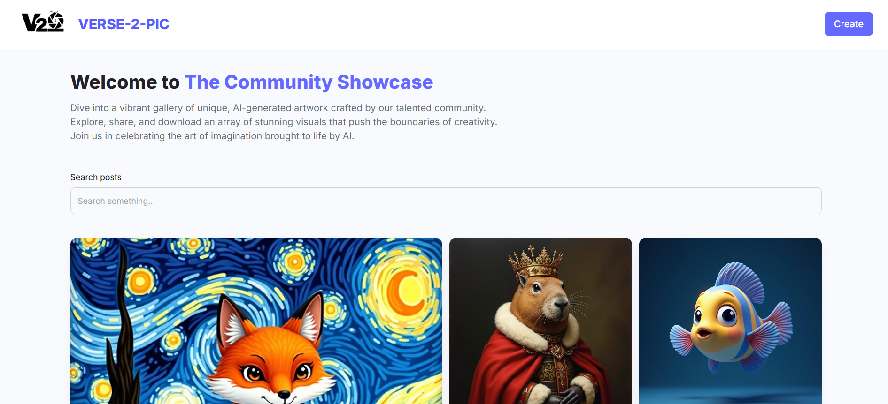
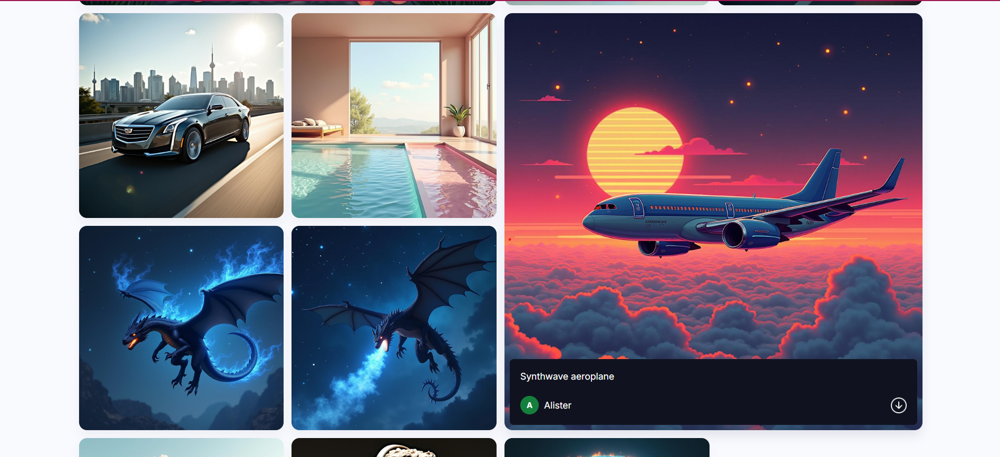
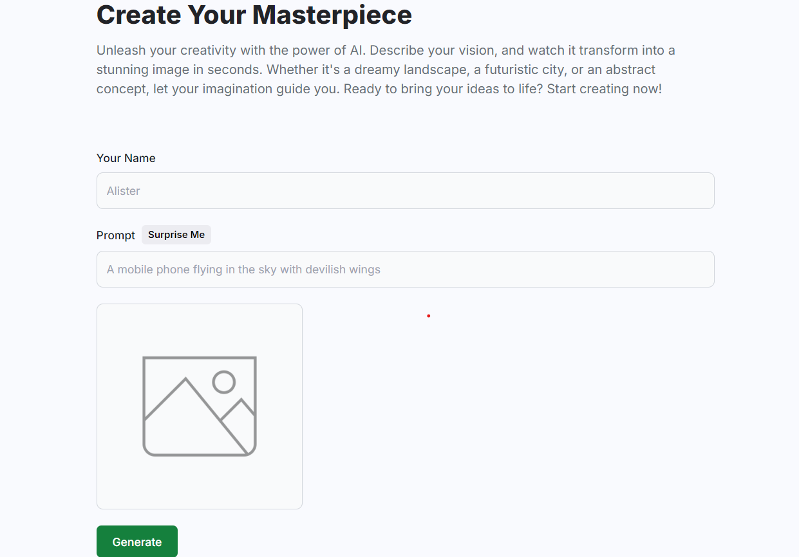
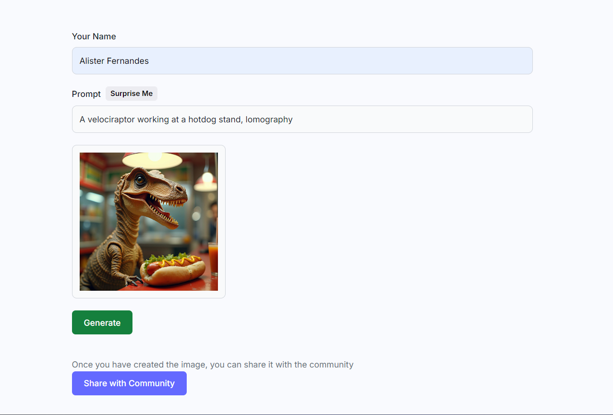

# **VERSE-2-PIC**

  
  


## **Table of Contents**

- [About the Project](#about-the-project)
- [Features](#features)
- [Tech Stack](#tech-stack)
- [Installation](#installation)
- [Usage](#usage)
- [Contributing](#contributing)
- [Contact](#contact)
- [Acknowledgements](#acknowledgements)

---

## **About the Project**

VERSE-2-PIC is a powerful text-to-image generation app where users can create unique images by providing descriptive text prompts. The platform also allows users to share their generated images with the community and download them for personal use. The app leverages cutting-edge AI models from Hugging Face to generate high-quality images based on user input.

---

### **Project Screenshots**

1. Home:  
   
   
2. Create Post:  
   
3. Image Generated:  
   

---

## **Features**

- Generate images by providing text prompts.
- Share generated images with a community.
- Download images for personal use.
- Responsive and modern user interface.
- Image storage and management via Cloudinary.

---

## **Tech Stack**

- **Frontend:** React, Tailwind CSS
- **Backend:** Node.js, Express
- **Database:** MongoDB
- **API:** Hugging Face
- **Other:** Cloudinary
- **Deployment:** Vercel

---

## **Installation**

1. Clone the repo:

   ```bash
   git clone https://github.com/Alister1210/verse-2-pic.git
   ```

2. Install dependencies:

   ```bash
   npm install react react-router-dom tailwindcss axios @huggingface/inference cloudinary cors dotenv express mongoose nodemon
   ```

3. Run the project:
   - In the client directory:
     ```bash
     npm run dev
     ```
   - In the server directory:
     ```bash
     npm start
     ```

---

## **Usage**

Visit the live version of the project at [VERSE-2-PIC](https://verse-2-pic.vercel.app). Enter a text prompt to generate an image, share it with the community, or download it for your personal use.

---

## **Contributing**

Contributions are welcome! Please follow these steps:

1. Fork the repository.
2. Create a new feature branch (`git checkout -b feature/NewFeature`).
3. Commit your changes (`git commit -m 'Add some NewFeature'`).
4. Push to the branch (`git push origin feature/NewFeature`).
5. Open a pull request.

---

## **Contact**

Alister Fernandes - [LinkedIn](https://www.linkedin.com/in/alister1210/) - alisterfernandes1210@gmail.com

Project Link: [https://github.com/Alister1210/verse-2-pic](https://github.com/Alister1210/verse-2-pic)

---

## **Acknowledgements**

- [ZB-Tech/Text-to-Image](https://huggingface.co/ZB-Tech/Text-to-Image) (Hugging Face API)
- [JavaScript Mastery](https://www.youtube.com/c/JavaScriptMastery)
